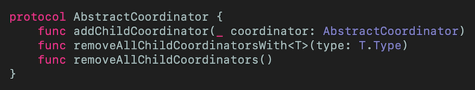
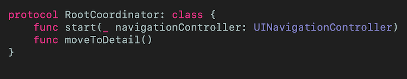
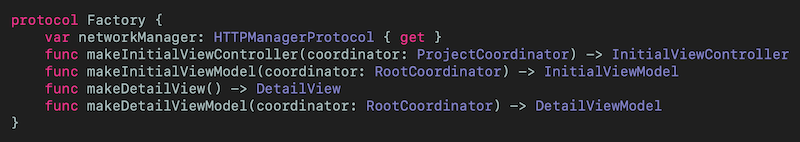
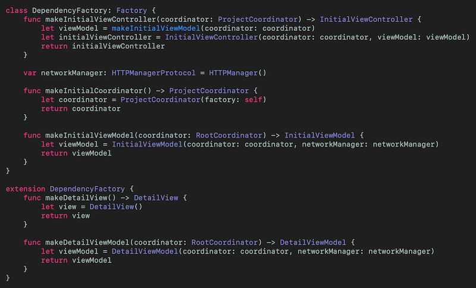
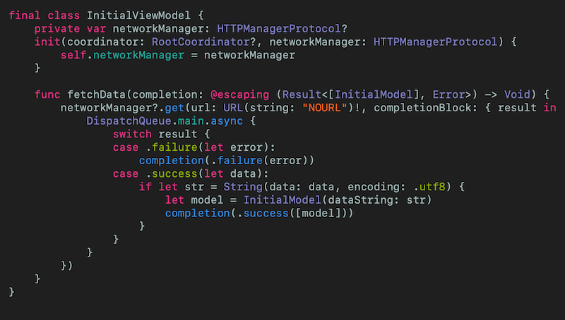
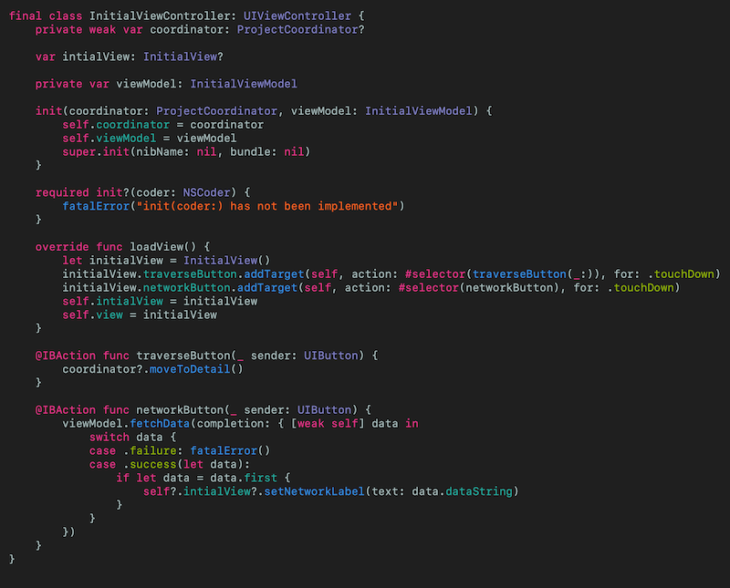
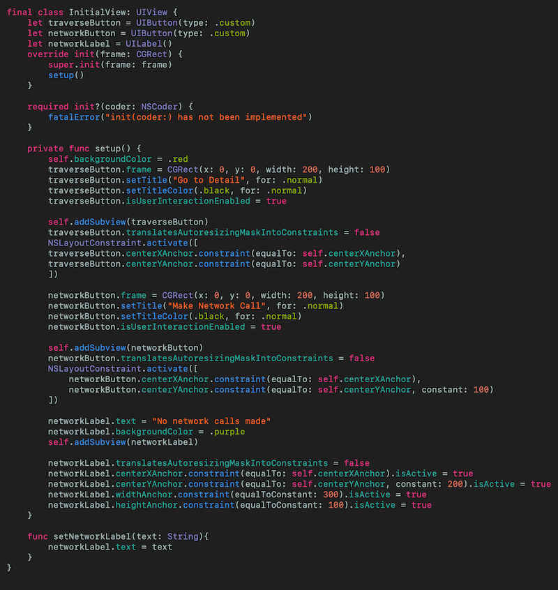
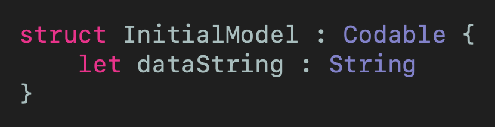

# MVVM-C with Dependency Injection
## A complete example

 
Photo by Théo rql on Unsplash

I've been using MVVM-C for quite some time. I'm sure you (probably, I don't know you) agree  that by abstracting the navigation away from the main [MVVM](https://medium.com/@stevenpcurtis.sc/mvvm-in-swift-19ba3f87ed45) architecture code gives you the opportunity for testing.  Great!
What if you have multiple dependencies? How are these going to be injected into your...wait.. where...what?  
Making this clear is the goal of this article.

Difficulty: Beginner | Easy | **Normal** | Challenging 
This article has been developed using Xcode 11.4.1, and Swift 5.2.2

## Prerequisites: 
* You will be expected to be aware how to make a [Single View Application](https://medium.com/swlh/your-first-ios-application-using-xcode-9983cf6efb71) in Swift.
* Some experience of architecture patterns are required, whether [MVC](https://medium.com/swift-coding/mvc-in-swift-a9b1121ab6f0) or [MVVM](https://medium.com/@stevenpcurtis.sc/mvvm-in-swift-19ba3f87ed45). 
* The principles of [Dependency Injection](https://medium.com/@stevenpcurtis.sc/learning-dependency-injection-using-swift-c94183742187) are explained in this article, but some in-depth explanation always helps! 
* You'll need to be comfortable with [protocols](https://medium.com/@stevenpcurtis.sc/protocols-in-swift-f46c31283b18)

## Terminology:
Factory Pattern: A design pattern where an object is created without exposing the creation logic to the client. The factory pattern lets a class defer instantiation to subclasses.

# The Problem
MVVM-C helps with separation of concerns, and allows testing and implementation to be...much better than [MVC](https://medium.com/swift-coding/mvc-in-swift-a9b1121ab6f0). Now, nothing is perfect, but it is perfectly possible to have a variety of dependencies which can lead to large and unwieldy initializers. 

One possible solution to this is use of the Factory Pattern, and the use of Dependency Injection to test the relevant classes. This particular article is written with the views programmatically defined, [avoiding Storyboards](https://medium.com/@stevenpcurtis.sc/avoid-storyboards-in-your-apps-8e726df43d2e) in the entire project, and neatly [overriding loadview()](https://medium.com/@stevenpcurtis.sc/write-clean-code-by-overriding-loadview-ac4f172163d0).

With that understood, let's get to it!

# The Example
The idea of this article is to have a basic skeleton for the MVVM-C architecture. There are few around, particularly coded in Swift and even fewer making an attempt at testing.

You're probably working in a shop where they demand 80% test coverage - and this article and the accompanying [repo](https://github.com/stevencurtis/MVVM-CDependency) isn't quite there (this example isn't promised to be production ready), however it is a very good start for a developer to build on. 

The coordinator has the following responsibilities:
* Initialize the network service
* Perform network calls
* Initialize the ViewModel with the fetched data (or instruct the ViewModel to handle a failed network call)

# The Implementation
One of the best ways to explore the implementation is do download the [files](https://github.com/stevencurtis/MVVM-CDependency) to your machine and take a look. Give me a nice star when you're there (if you can).
I've created everything programmatically [avoiding storyboards](https://medium.com/@stevenpcurtis.sc/avoid-storyboards-in-your-apps-8e726df43d2e)

## The coordinator
This is at the heart of the matter, because the coordinator controls the flow of the App. If a `UIViewController` wishes to move to another `UIViewController` it must do so through the coordinator. 

The main Coordinator is called `ProjectCoordinator` that conforms to a RootCoordinator protocol and  `AbstractCoordinator` protocol. By using `protocols` rather than base classes you do end up with a rather more Swifty solution - something recommended for Swift developers.

### The coordinator protocols 
 
[Click for Gist](https://gist.github.com/stevencurtis/bb617fce7a1b660bcb121adf46c633f1) 

 
[Click for Gist](https://gist.github.com/stevencurtis/e132950ef62d75fe9e08706e0afa1412)

Which are then put to use in out `ProjectCoordinator` class.

### The ProjectCoordinator concrete class
The `ProjectCoordinator`  has knowledge of just the factory class, which it uses to create the `InitialViewController` instance which is then pushed on the `UINavigationController` stack. The reference to `navigationController` is weak to prevent a retain cycle as the `UIViewController` instance has a reference to the `ProjectCoordinator`.

The `moveToDetail()` function demonstrates how moving between `UIViewController` instances could work, and in fact if we wanted to pass parameters or values from one `UIViewController` to another (although questions should be raised about why you're not doing this through the model) it could be done here.

## The Factory
The Dependency Factory class lets us inject services. This example has a 'fake `HTTPManager`'  based upon [my basic http manager](https://medium.com/@stevenpcurtis.sc/my-basic-httpmanager-in-swift-db2be1e340c2) class at it's heart, although I'm sure you have your own solution for making network calls (don't feel like I'm bullying you into this).

### The Factory protocols
For better testing this conforms to my `Factory` protocol that enforces conforming classes to have a network manager and the minimum functions in order to create the `UIView` instances and `UIViewController` instances.

 
[Click for Gist](https://gist.github.com/stevencurtis/e8b239e0de6831bd401abd23f6499e46)

### The dependency factory concrete class
The dependency factory creates these artifacts that will be used to create the objects that our App requires.

 
[Click for Gist](https://gist.github.com/stevencurtis/0b1c56e6cfd49704cc57448dfd120bde)

## The ViewModel classes
The view models know about the coordinator (but not about the factory). With this design, the view model can hit the coordinator for navigation, and make the transitions happen. Equally the view model has the dependency - the network manager. 

The view model creates the model from here when the network model returns data from the Endpoint API.

 
[Click for Gist](https://gist.github.com/stevencurtis/9c2ee3d0996a9084bfebeea7c65f8fef)

## The ViewController classes
The `UIViewController` classes are responsible for the `UIView` classes, and since in this implementation they have no dependencies these are created within the `UIViewController`. 

**The initializer**
I sometimes choose to let the `UIViewController` control navigation, and this means that my `UIViewController` classes have visibility of the `Coordinator` class.

Equally, the view controller has viability of the view model class, and it is the viewmodel classes that are used for network calls in this implementation.

Initialization from the storyboard is not currently supported.

 
[Click for Gist](https://gist.github.com/stevencurtis/d8fb08445dddcba65fea190791864f01)

## The View classes
The views are rather dumb here, don't have any dependencies and just set up their subviews. For the sake of completion, the `InitialView` is shown here

 
[Click for Gist](https://gist.github.com/stevencurtis/3a4e713fc3e0cf7a45548dded7976955)

## The Model classes
The example doesn't have a particularly inspiring model. At all. I've created a model with just a single dataString. 

You might well use this to store something like user details (obtained by an API), or whatever. The choice is yours.

Unfortunately there isn't much to learn from this class, but for completion's sake here is the code:
 
[Click for Gist](https://gist.github.com/stevencurtis/9ce4149dda6354ba725820a9e7cd66c1)

# Testing
This article is not about testing specifically, but does contain tests and mocks partly because there is so little out there in existing articles.

To keep this article readable (or at least approaching readable) I've kept the implementation details of these tests to the repo. To access the code hop over to [the repo ](https://github.com/stevencurtis/MVVM-CDependency) and press download. You can then read through the files, but below is the explanation of the same.

## Unit testing

### ViewModels
These would require mocked `RootCoordinator` and `HTTPManagerProtocol`. No problem, as `FactoryMock` and `CoordinatorMock` show we can create . 

### UIViews
The views should not usually be unit tested. What are you going to check? The positions of the view in a container that doesn't exist?
For completeness, if you wanted to do this the code is included in `InitialViewTests`

### The coordinator
We can mark a test function with throws, and any exception would cause the test to fail. This can be used in conjunction with a `guard` statement a mock for `UINavigationController` to ensure the correct View Controller is pushed onto the `UINavigationController`  (well, a mock of `UINavigationController` ) stack.

### The Factory
It doesn't make any sense to test the dependency factory, as it is this class that is replaced for the tests. `FactoryTests` is simply empty. 

# Conclusion

I hope this article has helped you out, going through the relevant classes that enable you to create a MVVM-C implementation.

If you've been using [MVC](https://medium.com/swift-coding/mvc-in-swift-a9b1121ab6f0) I appreciate this might seem like a change and, yes, well it is. 

However having different methods of producing your App will only help in the long run, and I hope that this article has really helped you out. 

Thanks for reading!

If you've any questions, comments or suggestions please hit me up on [Twitter](https://twitter.com/stevenpcurtis) 
